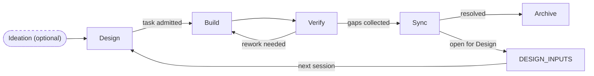
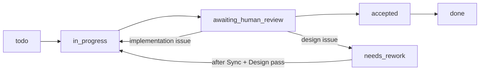

# Workflow Reference

Long-form reference for the repo workflow.

Use `AGENTS.md` for the AI runtime contract.
Use `docs/core/workflow-summary.md` for the short human guide.
Use this file when a workflow rule, artifact boundary, or stage transition needs clarification.
Use `docs/optional/concurrency-overlay.md` when concurrent design/build/verify work or multi-user/multi-agent execution within a shared branch needs extra coordination.
Use `docs/guides/distributed-teams.md` when multiple people are working in separate workspace branches that merge periodically.

## Naming convention
- `README.md`: human entrypoint
- `AGENTS.md`: AI entrypoint
- stage-folder `README.md`: human local guide
- `UPPER_SNAKE_CASE.yaml`: canonical register data — **edit this**
- `UPPER_SNAKE_CASE.md`: generated table view of the `.yaml` — do not edit directly; run `make render` to regenerate
- `lower-kebab-case.md`: explanatory and reference docs
- `*_TEMPLATE.*`: scaffolds and templates

Uppercase file names mark shared canonical state.
The `.yaml` files are the source of truth; agents and humans edit YAML.
The `.md` table views are for reading (e.g. in a Markdown preview).

## Stage shorthands
- **Verify**: "Is the current task resolved satisfactorily?" — task scope, implementation quality
- **Sync**: "Does what was built fit what the design says?" — design scope, alignment between implementation and design spec

These are different questions. Verify can pass while Sync still has work to do.

## Loop philosophy
The workflow is designed for fast, complete loops — not prolonged single cycles.

**A short loop that records what was incomplete is more valuable than a long loop that tries to eliminate all uncertainty.**

What this means in practice:
- Design enough to take a confident step. The IRG gate protects against the two failures that cause wasted work: unknown acceptance criteria (A) and unclear interfaces (I). Other dimensions at 1 are known unknowns — survivable and recoverable in the next loop.
- All gaps and deviations discovered during Build/Verify are recorded in `3-verify/GAPS_AND_DEVIATIONS.yaml` — including ones resolved within the loop. A covered deviation is still a silent design change that must be ratified.
- Sync triages all entries: quick-close (update design docs, add to `4-sync/archive/DESIGN_INPUTS.yaml` (create from `templates/init/4-sync/INIT_DESIGN_ARCHIVE_TEMPLATE.yaml` if not present)) or open for Design (`DESIGN_INPUTS`).
- Every new Design session starts by reading `4-sync/DESIGN_INPUTS.md` for open items before pulling new work.
- Do not skip Sync. Even when all gaps were resolved in-loop, Sync must complete the triage.

**Anti-pattern to avoid:** staying in Design trying to answer every open question before starting. If Acceptance and Interfaces are clear (A=2, I=2), you have enough. Run the loop. Record what you learn.

**Preferred pattern when gaps accumulate mid-Build:** If discovered gaps make continuing dangerous — acceptance criteria or interface assumptions prove invalid, or resolving one gap would cascade into others — stop and fail quickly rather than continuing on a broken foundation. Each additional step on a broken design produces deviations that compound and risk conflicting with other documented specs. Stop, record, run abbreviated Verify+Sync, and address at the next Design session. See **Fail-quickly** in Build rules.

## Canonicality model
Narrative docs explain the workflow.
The stage registers carry the live state.

Core canonical registers (`.yaml` = source of truth; `.md` = generated view):
- `1-design/PROJECT_BRIEF.md` (Markdown narrative, edit directly)
- `1-design/FEATURE_REGISTRY.yaml` — permanent feature identity; never split, never pruned
- `1-design/DESIGN_STATES.yaml` — active design triage; features move to `1-design/archive/DESIGN_STATES.yaml` when complete
- `1-design/TASK_READINESS.yaml`
- `1-design/ROADMAP.yaml`
- `2-build/WORK_QUEUE.yaml`
- `3-verify/TRACEABILITY_MATRIX.yaml` — spec/code/test linkage (task completion scope)
- `3-verify/FEEDBACK_MATRIX.yaml` — human test observations
- `3-verify/GAPS_AND_DEVIATIONS.yaml` — design gaps and deviations staged for Sync
- `4-sync/DESIGN_INPUTS.yaml` — open items for the next Design cycle (live register)
- `4-sync/archive/DESIGN_INPUTS.yaml` — resolved items (historical record; created on demand by Sync when DESIGN_INPUTS becomes large)

## Template repo exception
This repository ships with a workspace-setup task in `WORK_QUEUE` and `TASK_READINESS`. `DESIGN_STATES` and `TRACEABILITY_MATRIX` ship empty.
When changing the template itself, update the setup task only when the default initialization flow changes.

Optional registers come into play only when the current task or project setup needs them:
- `0-ideation/IDEATION_BACKLOG.yaml` / `0-ideation/archive/IDEATION_BACKLOG.yaml`
- `1-design/QUALITY_REQUIREMENTS.yaml` / `1-design/archive/QUALITY_REQUIREMENTS.yaml`
- `1-design/decisions/`
- `2-build/TASK_DEPENDENCIES.yaml`
- `2-build/LOCKS.yaml`
- `2-build/TEMP_MEASURES.yaml` / `2-build/archive/TEMP_MEASURES.yaml`
- `3-verify/SIGN_OFF.md`
- specialist advisory files in `3-verify/`
- specialist sign-off fields on `TASK_READINESS.yaml` task rows and `GAPS_AND_DEVIATIONS.yaml` entries — human domain-expert approval gates at Design, Verify, and/or Sync (see `docs/optional/specialist-tracks.md`)
- `4-sync/HANDOFFS.md`
- `4-sync/RELEASE_QUEUE.yaml` — deployment release candidates; workspace-deployment reads `candidate` entries via `make populate`

## Register design rationale

### FEEDBACK_MATRIX

FEEDBACK_MATRIX exists for three reasons that together justify a dedicated register rather than writing directly into GAPS_AND_DEVIATIONS:

1. **Triage buffer.** Not all human feedback requires a build change. Some observations are informational, some are design questions, some close immediately as non-issues. FM is the intake layer where a listening agent evaluates each item and decides what — if anything — to promote to G&D. This keeps G&D as a curated, signal-only staging register rather than a raw dump of everything humans said.

2. **Attribution chain.** Whether a gap or deviation was discovered by agent analysis or surfaced by a human reviewer is meaningful for retrospectives and for understanding why a design drifted. FM preserves the human-origin attribution; the `source_ref` field on G&D entries links back to the FM entry, maintaining the chain: human observation → FM → G&D → DESIGN_INPUTS.

3. **External system bridge.** FM entries can carry references to external issue trackers (Jira, Linear, GitHub Issues). This is an optional, org-level extension — the core schema does not require an `external_ref` field, but adopters with external trackers can add one and the traceability chain from ticket → FM → G&D remains intact.

The human review interface is deliberately indirect: humans do not write to FM or G&D themselves. A listening agent captures human feedback into FM; the agent then evaluates FM entries and writes G&D entries. This keeps the classification of gap vs. deviation as an agent responsibility, not a burden on the human reviewer.

### TRACEABILITY_MATRIX

TRACEABILITY_MATRIX exists for three reasons:

1. **Scope accountability.** TM declares the legitimate implementation scope for each feature — the spec, the code paths, and the tests that cover it. Any change produced in Build or Verify that falls outside declared scope is implicitly unaccounted for. TM provides the reference point that makes scope creep and shadow work visible rather than invisible.

2. **Build-writable feature-level gate.** DESIGN_STATES is the feature-level design record but is Design-owned — Build may not write to it (except in the fail-quickly case). TM is the Build-writable equivalent: `drift_status` is the feature-level alignment signal that Build can update during the active loop without touching the Design-stage record. This is the load-bearing reason TM exists as a separate register rather than a field on DESIGN_STATES.

3. **Human-change accountability.** Changes to the codebase can arrive from sources other than admitted tasks — human feedback routed through FM, or direct human prompting outside the formal workflow. Within declared feature scope, TM detects these as `drift_detected` and forces a G&D entry. Outside declared scope, TM cannot catch them; a workflow rule covers that gap (see **Unlinked changes** in Build rules).

TM and G&D are complementary, not redundant. G&D is reactive — it records design questions and deviations that surfaced during the loop. TM is the proactive scope declaration that makes unrecorded changes detectable in the first place.

## Core loop
`Design -> Build -> Verify -> Sync`

Ideation is optional and sits before design when the team is not ready to commit to a design direction.

## Stage map
| Stage | Goal | Canonical updates | Notes |
| --- | --- | --- | --- |
| Ideation (optional) | clarify uncertain value, scope, or direction | `0-ideation/IDEATION_BACKLOG.yaml` when ideation is in use | ideas can go straight to design when scope is already clear |
| Design | address open DESIGN_INPUTS, then shape and gate new work | `DESIGN_INPUTS.yaml` first (address open items), then `PROJECT_BRIEF.md`, `DESIGN_STATES.yaml`, `ROADMAP.yaml`, `WORK_QUEUE.yaml` | start by reading `4-sync/DESIGN_INPUTS.yaml`; `needs_redesign` features must be resolved before new build admission |
| Build | implement admitted tasks only | code/tests, `WORK_QUEUE.yaml`, `TRACEABILITY_MATRIX.yaml`, `GAPS_AND_DEVIATIONS.yaml` when gaps surface | record all gaps/deviations in GAPS_AND_DEVIATIONS — including covered ones |
| Verify | "Is the current task resolved satisfactorily?" | `TASK_READINESS.yaml` (advisor gate check), `FEEDBACK_MATRIX.yaml` (human testing), `GAPS_AND_DEVIATIONS.yaml` (promote items), Acceptance Gate checklist (just-in-time), `SIGN_OFF.md` (if in use); move resolved entries to their `archive/` counterparts | Build and Verify loop until task is accepted; all gaps/deviations must be in GAPS_AND_DEVIATIONS before exit |
| Sync | "Does what was built fit what the design says?" | triage `GAPS_AND_DEVIATIONS.yaml` → `DESIGN_INPUTS.yaml` (needs Design) or close now (update design docs); move triaged entries to `archive/GAPS_AND_DEVIATIONS.yaml`; reconcile `WORK_QUEUE.yaml`, `ROADMAP.yaml`, `TRACEABILITY_MATRIX.yaml`; move `done` tasks and `completed`/`parked` capabilities to their `archive/` files; if `RELEASE_QUEUE.yaml` is in use, add `candidate` entry for work approved to ship | do not skip; triage must complete before next Design session |

## Design admission model
Design readiness for individual tasks lives in `1-design/TASK_READINESS.yaml`.
Execution tracking for admitted tasks lives in `2-build/WORK_QUEUE.yaml`.

`TASK_READINESS.yaml` uses two readiness values:
- `needs_detail`: not yet safe to build
- `ready_for_build`: IRG gate cleared; promote the task to WORK_QUEUE and confirm that `spec_link`, `advisor_track`, `advisor_status`, `quality_requirements`, and `decision_links` are present in the WORK_QUEUE entry (copy from TASK_READINESS if not already populated)

### IRG: qualitative mode (default)

At low process depth, the IRG is a two-question check: do I know what done looks like, and do I know what I'm building against? If both are yes, set `readiness: ready_for_build` and record the reasoning in `notes`. No numeric scoring needed — the `irg:` block can be left empty.

### IRG: full numeric mode

When the qualitative check is no longer precise enough (multiple tasks in flight, multiple reviewers, design disagreements), upgrade to the five-dimension numeric rubric:

- `S` = scope and outcome clarity
- `A` = acceptance criteria
- `I` = interfaces and contracts
- `R` = dependencies and risks
- `V` = verification plan

Pass criteria: total ≥ 8, with A = 2 and I = 2 required. Other dimensions (S, R, V) may be 1 at admission — those gaps become inputs to the next loop. Full criteria in `docs/optional/consistency-gates.md` under **Ready-to-implement measure**.

See `docs/optional/full-irg-scoring.md` for the full guide to both modes.

### Advisor vs. specialist: authority model

Two separate gate mechanisms exist for domain-sensitive tasks, with distinct authority levels:

| Concept | Fields | Set by | Meaning |
|---------|--------|--------|---------|
| **Advisor** (AI) | `advisor_track`, `advisor_status` | Agent | AI applies specialist-level analysis and records findings. `advisor_status: complete` means the analysis is done — not that a human approved it. |
| **Specialist** (Human) | `specialist_sign_off` | Human only | Named domain expert reviews and approves. `approved` or `waived` is a human decision; the agent must not self-approve. |

These are independent gates. Both can be required on the same task: the advisor completes analysis first; the human specialist reads the findings and makes the authority decision.

`advisor_track` values: `security` | `experiment` | `incident` | `data_migration` | `api_contract` | `none`  
`advisor_status` values: `not_required` | `pending` | `complete`

### Concurrent stage isolation

`TASK_READINESS.yaml` and `WORK_QUEUE.yaml` are kept as separate files for two reasons:

1. **Stage ownership**: TASK_READINESS is the Design-stage record (IRG scores, readiness gate); WORK_QUEUE is the Build/Verify execution record.

2. **Admission snapshot and concurrent write safety**: At admission, Design copies `spec_link`, `advisor_track`, `advisor_status`, `quality_requirements`, and `decision_links` into the WORK_QUEUE entry. After that point, WORK_QUEUE is the authoritative source for these fields during Build and Verify — Build/Verify never needs to open TASK_READINESS for them. This means Design can continue updating TASK_READINESS for other tasks in parallel without causing drift in an active build loop.

## Build rules
- Pull work from `2-build/WORK_QUEUE.yaml`, not from a separate manual summary.
- **Sequential build loop (agents):** Implement **one** admitted task per pass; when the user wants git history, **commit that task only**, then pick the next **buildable** row. When no buildable tasks remain, re-scan the queue — tasks blocked only by `build_dependencies` become buildable after upstream tasks reach **`accepted`** or **`done`**. Full algorithm and TrueSight V1 ordering: [`docs/design/build-agent-loop.md`](../../../docs/design/build-agent-loop.md).
- Before pulling new work, check `2-build/WORK_QUEUE.yaml` for any `needs_rework` tasks and handle them first.
- Keep queue status, owner, notes, and validation current in the same change set as the implementation.
- Keep `3-verify/TRACEABILITY_MATRIX.yaml` current while building. When setting `drift_status: drift_detected`, create a matching entry in `3-verify/GAPS_AND_DEVIATIONS.yaml`. Reset to `aligned` only after that entry is `resolved_in_loop` or `promoted_to_sync`.
- Do not update `1-design/DESIGN_STATES.yaml` during Build or Verify. `drift_detected` in `TRACEABILITY_MATRIX.yaml` is the blocking signal for the active loop; `needs_redesign` in `DESIGN_STATES.yaml` is set only by Sync — except in the fail-quickly case below.
- Do not write to `1-design/ROADMAP.yaml` during Build. If a capability is discovered to be at risk, or a target-window assumption no longer holds, record the observation in `3-verify/GAPS_AND_DEVIATIONS.yaml`; Sync will update ROADMAP after triage. Design is the only other stage that may update ROADMAP (when admitting new tasks or capabilities).
- Read `spec_link`, `advisor_track`, `advisor_status`, `quality_requirements`, and `decision_links` directly from the WORK_QUEUE entry. Do not open `TASK_READINESS.yaml` for these fields during Build or Verify — WORK_QUEUE holds the admission-time snapshot and is the authoritative source (see **Concurrent stage isolation** above). Open TASK_READINESS only when IRG scoring context is needed.
- If `1-design/QUALITY_REQUIREMENTS.yaml` is in use: read all `sustained` requirements at build start — they apply to every task. For tasks with `quality_requirements` entries in `TASK_READINESS.yaml`, open `QUALITY_REQUIREMENTS.yaml` and verify each linked `per_task` or `milestone` QR is addressed in the implementation and validation.
- If `Mode = parallel`, claim a matching lock before editing when `2-build/LOCKS.yaml` is in use.
- After editing any register YAML, run `make render` to regenerate the `.md` table views.
- **Unlinked changes:** Any change to the codebase during Build or Verify that is not directly executing an admitted task — whether prompted through FM, direct human instruction, or agent judgment — must produce a G&D deviation entry before the session ends. If the change introduces scope that no existing feature or task covers, a retrospective task entry in WORK_QUEUE is required. Changes within declared TM `code_refs` are caught by `drift_detected`; changes outside all declared scope are caught by this rule. Both paths route through G&D → Sync for triage.
- **Fail-quickly:** If accumulated gaps make continuing dangerous — acceptance criteria or interface assumptions prove invalid mid-implementation, or resolving one gap would cascade into others — stop Build immediately: set the task to `blocked` in `WORK_QUEUE.yaml`; record all gaps in `3-verify/GAPS_AND_DEVIATIONS.yaml`; set `design_state: needs_redesign` directly in `1-design/DESIGN_STATES.yaml` (the one sanctioned exception to the write prohibition above); then run abbreviated Verify+Sync — promote all open GDs to `4-sync/DESIGN_INPUTS.yaml` without completing the full verification loop. Address open DESIGN_INPUTS items at the start of the next Design session.

## Verify and acceptance rules
- Run the checks named in the queue `Validation` field plus any required tests or manual checks.
- Record all gaps and deviations in `3-verify/GAPS_AND_DEVIATIONS.yaml` as they surface — including ones resolved within the Build/Verify loop.
- Human testing observations go in `3-verify/FEEDBACK_MATRIX.yaml` (types: `observation`, `issue`, `pass`, `regression`). The agent reads `diagnosis` fields and creates corresponding `GAPS_AND_DEVIATIONS.yaml` entries — humans do not write to G&D directly.
- Record evidence and ensure GAPS_AND_DEVIATIONS is current, then move the task to `awaiting_human_review`.
- The human uses `3-verify/acceptance-gate.md` to make the accept/reject decision. If `3-verify/SIGN_OFF.md` is in use, record an entry before closing.
- On rejection: if the issue is an implementation fix (Build can address it), set status to `in_progress`. If the rejection reveals a design-level problem, set status to `needs_rework` and `TASK_READINESS.Readiness` to `needs_detail` — Sync must still run before the next Design session.
- `accepted` requires: Acceptance Gate complete.
- `done` means Sync updates are complete too.

Default status path:
`todo -> in_progress -> awaiting_human_review -> accepted -> done`

## Sync rules
- Read `4-sync/DESIGN_INPUTS.yaml` first — understand what is already open before triaging new entries.
- Read `3-verify/GAPS_AND_DEVIATIONS.yaml` as the primary Sync input.
- For each entry, decide: can this be closed now (quick design doc update) or does it need a full Design cycle?
  - Quick close → update design docs, add to `4-sync/archive/DESIGN_INPUTS.yaml` (create from `templates/init/4-sync/INIT_DESIGN_ARCHIVE_TEMPLATE.yaml` if not present) with `resolution_type: incorporated` or `dismissed`.
  - Needs Design → add to `4-sync/DESIGN_INPUTS.yaml` with `status: open`. Set the linked feature's `design_state` to `needs_redesign` in `DESIGN_STATES.yaml`.
- Move each triaged GAPS_AND_DEVIATIONS entry to `3-verify/archive/GAPS_AND_DEVIATIONS.yaml`. If specialist sign-off is in use and an entry has `specialist_review.status: pending`, it must not be archived until a specialist approves or waives it.
- Reconcile `WORK_QUEUE.yaml`, `ROADMAP.yaml`, and `TRACEABILITY_MATRIX.yaml` after triage. Move `done` tasks to `2-build/archive/WORK_QUEUE.yaml` and their matching rows in `TASK_READINESS.yaml` to `1-design/archive/TASK_READINESS.yaml`; move `completed` or `parked` capabilities to `1-design/archive/ROADMAP.yaml`. For any feature whose tasks are all now in `archive/WORK_QUEUE` and has no open `DESIGN_INPUTS` entries, set `design_state: complete` in `DESIGN_STATES.yaml` and move the row to `1-design/archive/DESIGN_STATES.yaml`.
- If `4-sync/RELEASE_QUEUE.yaml` is in use: assess whether the completed work is ready to ship. For approved work, add an entry with `release_state: candidate`. Include a `components` list with the name and version label of each component included in the release — workspace-deployment reads these to auto-fill `scope[].ref` in the deployment brief. A release can be scoped to any combination of tasks regardless of milestone or feature alignment — use `release_type` to distinguish feature releases from bugfixes, performance work, and architecture changes.
- Sync is not optional. Even when all GAPS_AND_DEVIATIONS entries were resolved in-loop, triage must complete.

## Dependency semantics
- `Build Dependencies`: downstream work runs only after every listed upstream task is **`accepted`** or **`done`** in `WORK_QUEUE.yaml` (human acceptance gate passed). Implementation may exist earlier on the branch; the queue gate is intentional. See [`docs/design/build-agent-loop.md`](../../../docs/design/build-agent-loop.md).
- `Design Dependencies`: downstream work must wait for verified upstream learning and a later design refresh.

Use `2-build/TASK_DEPENDENCIES.md` only when dependency management needs more structure than the queue alone.

## Optional artifact guidance
Use optional files only when the problem justifies the extra coordination cost:

- `0-ideation/IDEATION_BACKLOG.yaml` / `0-ideation/archive/IDEATION_BACKLOG.yaml`: uncertain ideas before design commitment
- `1-design/QUALITY_REQUIREMENTS.yaml`: durable nonfunctional or cross-cutting requirements; split into active and `archive/` files
- `1-design/decisions/`: architecture, contract, ownership, or rollout decisions that need a durable record
- `2-build/TASK_DEPENDENCIES.md`: explicit dependency tracking
- `2-build/LOCKS.md`: concurrent editing coordination within a shared branch
- `docs/optional/concurrency-overlay.md`: opt-in coordination overlay for higher-concurrency same-branch projects
- `1-design/CONTRACTS.yaml`: shared interface contracts between parallel workstreams (created on demand; see `docs/optional/contracts.md`)
- `docs/guides/distributed-teams.md`: split workspace model for separate-branch parallel work
- `2-build/TEMP_MEASURES.yaml` / `2-build/archive/TEMP_MEASURES.yaml`: temporary exceptions with removal targets
- `3-verify/SIGN_OFF.md`: formal acceptance audit trail per task
- `4-sync/HANDOFFS.md`: explicit ownership transfer history
- `4-sync/RELEASE_QUEUE.yaml`: deployment release candidates; use when workspace has a deployment pipeline (e.g. workspace-deployment). Entries set `release_state: candidate` to signal readiness and include a `components` list (name + version label per component); workspace-deployment reads these entries via `make populate` and uses `components[].version` to fill `scope[].ref` in the deployment brief. Releases can be feature, bugfix, performance, architecture, or mixed — not constrained to capability boundaries.

## Related references
- `docs/optional/specialist-tracks.md`: specialist advisor selection, gating, and advisory records
- `docs/optional/consistency-gates.md`: drift and admission rules, plus required checks
- `docs/core/operations.md`: commands and operational notes
- `docs/core/glossary.md`: shared workflow terminology
