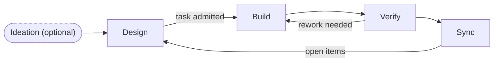

# Workflow Summary

Short human-facing guide to the repo workflow.

Use this file for the one-page version.
Use `AGENTS.md` for the AI runtime contract.
Use `docs/core/workflow-reference.md` when you need the long-form workflow reference.
Use `docs/optional/concurrency-overlay.md` when concurrent design/build/verify work or multi-user/multi-agent coordination within a shared branch needs extra structure.
Use `docs/guides/distributed-teams.md` when multiple people are working in separate workspace branches that merge periodically.

## Core loop
Optional ideation, then:

`Design -> Build -> Verify -> Sync`

**Stage shorthands:**
- **Verify**: "Is the current task resolved satisfactorily?" — task scope, implementation quality
- **Sync**: "Does what was built fit what the design says?" — design scope, alignment

## Canonical state files
- `1-design/PROJECT_BRIEF.md`: project context and constraints
- `1-design/DESIGN_STATES.md`: feature design maturity
- `1-design/TASK_READINESS.md`: per-task IRG scores, blocking unknowns, and build admission
- `1-design/ROADMAP.md`: capabilities (feature groupings) and target windows
- `2-build/WORK_QUEUE.md`: execution tracking — owner, status, and phase
- `3-verify/TRACEABILITY_MATRIX.md`: spec/code/test linkage
- `3-verify/FEEDBACK_MATRIX.md`: human test observations
- `3-verify/GAPS_AND_DEVIATIONS.md`: design gaps and deviations staged for Sync
- `4-sync/DESIGN_INPUTS.md`: open gaps and deviations for the next Design cycle (read first at Design start)
- `4-sync/archive/DESIGN_INPUTS.yaml`: resolved gaps and deviations (created on demand when DESIGN_INPUTS becomes large)

## Stage guide
| Stage | Main question | Update these files first | Exit condition |
| --- | --- | --- | --- |
| Ideation (optional) | Is the problem or direction still uncertain? | `0-ideation/IDEATION_BACKLOG.yaml` when ideation is in use | idea is promoted, parked, or dropped |
| Design | What are we building, and is it safe to implement? | `4-sync/DESIGN_INPUTS.md` first (address open items), then `DESIGN_STATES.md`, `TASK_READINESS.md`, `ROADMAP.md`, `WORK_QUEUE.md` | open DESIGN_INPUTS items addressed; task reaches `ready_for_build` |
| Build | Can we implement the admitted task safely? | code/tests, `WORK_QUEUE.md`, `TRACEABILITY_MATRIX.md`, `GAPS_AND_DEVIATIONS.md` when gaps surface | implementation is complete; all gaps/deviations recorded |
| Verify | Is the current task resolved satisfactorily? | `FEEDBACK_MATRIX.md` (human testing), `GAPS_AND_DEVIATIONS.md` (promote items); task moved to `awaiting_human_review` | human accepts via `acceptance-gate.md`; task is `accepted` |
| Sync | Does what was built fit what the design says? | triage `GAPS_AND_DEVIATIONS.md` → `DESIGN_INPUTS.md` (needs Design) or close now (update design docs); reconcile `WORK_QUEUE.md`, `ROADMAP.md`, `TRACEABILITY_MATRIX.md` | all GAPS_AND_DEVIATIONS triaged; DESIGN_INPUTS current for next Design |

## When to stop and fail quickly

If gaps accumulate mid-Build to the point where continuing is dangerous — acceptance criteria or interface assumptions prove invalid, or resolving one gap would cascade into others — **stop and fail quickly** rather than continuing on a broken foundation.

Each additional build step on a broken design produces deviations that compound, require more documentation correction, and risk conflicting with other documented specs. A blocked Build with a clean gap record is better than a completed Build with cascading deviations.

**Steps:**
1. Stop Build; set the task to `blocked` in `WORK_QUEUE.md`.
2. Record all discovered gaps in `GAPS_AND_DEVIATIONS.md`.
3. Set `design_state: needs_redesign` for the feature in `DESIGN_STATES.md`.
4. Run abbreviated Verify+Sync: promote all open GDs to `DESIGN_INPUTS.md` without completing the full verification loop.
5. Address open `DESIGN_INPUTS` items at the start of the next Design session before admitting new tasks.

## Build admission
A task must pass a readiness gate before moving to build. The gate checks design clarity, acceptance criteria, interfaces, and traceability. See `docs/core/workflow-reference.md` for the full criteria or `docs/optional/consistency-gates.md` for what `make docs-check` enforces.

## Optional files by concern
| Concern | File |
| --- | --- |
| uncertain ideas before design commitment | `0-ideation/IDEATION_BACKLOG.yaml` |
| durable nonfunctional or cross-cutting requirements | `1-design/QUALITY_REQUIREMENTS.md` |
| architecture or contract decisions worth preserving | `1-design/decisions/` |
| explicit task dependency tracking | `2-build/TASK_DEPENDENCIES.md` |
| parallel work coordination | `2-build/LOCKS.md` |
| specialist advisor involvement | `3-verify/SECURITY_REVIEWS.md`, `3-verify/EXPERIMENT_REVIEWS.md`, `3-verify/INCIDENT_RESPONSES.md`, `3-verify/DATA_MIGRATION_REVIEWS.md`, `3-verify/API_CONTRACT_REVIEWS.md` |
| ownership transfer history | `4-sync/HANDOFFS.md` |
| temporary exceptions with removal targets | `2-build/TEMP_MEASURES.yaml` |
| formal acceptance audit trail | `3-verify/SIGN_OFF.md` |
| opt-in overlay for heavy concurrent collaboration (same branch) | `docs/optional/concurrency-overlay.md` |
| split workspace model for separate-branch parallel work | `docs/guides/distributed-teams.md` |
| shared interface contracts between parallel workstreams | `1-design/CONTRACTS.yaml` |

## Default commands
- `make init`
- `make init-smoke`
- `make docs-check`
- `make docs-boundary`

Use `docs/core/operations.md` for the full command list.
