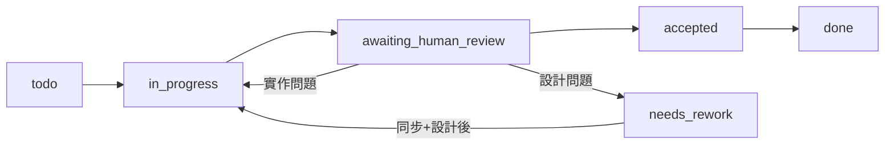

# 工作流程參考

儲存庫工作流程的長篇參考文件。

AI 執行時合約請使用 `AGENTS.md`。
簡短的人類指南請使用 `docs/core/workflow-summary.md`。
當工作流程規則、工件邊界或階段轉換需要澄清時使用此文件。
僅在並行設計/建置/驗證工作或多使用者/多代理執行需要額外協調時，才使用 `docs/optional/concurrency-overlay.md`。

## 命名慣例
- `README.md`：人類入口點
- `AGENTS.md`：AI 入口點
- 階段目錄 `README.md`：本地人類指南
- `UPPER_SNAKE_CASE.yaml`：規範性登記表資料——**編輯此檔案**
- `UPPER_SNAKE_CASE.md`：`.yaml` 的生成表格視圖——不直接編輯；執行 `make render` 重新生成
- `lower-kebab-case.md`：說明性和參考文件
- `*_TEMPLATE.*`：腳架和範本

大寫檔名標記共享的規範性狀態。
`.yaml` 檔案是真相來源；代理和人類編輯 YAML。
`.md` 表格視圖用於閱讀（例如在 Markdown 預覽中）。

## 階段簡稱
- **驗證（Verify）**：「目前的任務是否令人滿意地解決了？」——任務範圍、實作品質
- **同步（Sync）**：「建置的內容是否符合設計所說的？」——設計範圍、實作與設計規格之間的對齊

這是不同的問題。驗證（Verify）可以通過，而同步（Sync）仍有工作要做。

## 迴圈哲學
工作流程設計為快速、完整的迴圈——而非延長的單一週期。

**一個記錄了不完整之處的短迴圈，比一個試圖消除所有不確定性的長迴圈更有價值。**

實際意義：
- 設計到足以採取自信一步的程度。IRG 閘門防止兩種導致浪費工作的失敗：未知的驗收標準（A）和不清晰的介面（I）。其他維度為 1 是已知的未知事項——在下一個迴圈中可以生存和恢復。
- 在建置（Build）/驗證（Verify）過程中發現的所有缺口和偏差都記錄在 `3-verify/GAPS_AND_DEVIATIONS.yaml` 中——包括在迴圈中解決的那些。已解決的偏差仍是需要確認的靜默設計變更。
- 同步（Sync）分類所有記錄：快速關閉（更新設計文件，添加至 `4-sync/archive/DESIGN_INPUTS.yaml`（若不存在則從 `templates/init/4-sync/INIT_DESIGN_ARCHIVE_TEMPLATE.yaml` 建立））或開放供設計（DESIGN_INPUTS）。
- 每次新的設計（Design）階段先讀取 `4-sync/DESIGN_INPUTS.md` 的開放項目，再拉入新工作。
- 不要跳過同步（Sync）。即使所有缺口都在迴圈中解決，同步（Sync）仍必須完成分類。

**要避免的反模式：** 在設計（Design）中停留，試圖在開始之前回答每個開放問題。如果驗收（A）和介面（I）清晰（A=2、I=2），你已經有足夠的條件了。執行迴圈。記錄你學到的東西。

**建置（Build）中期缺口累積時的首選模式：** 如果發現的缺口使繼續下去變得危險——驗收標準或介面假設被證明無效，或解決一個缺口會引發連鎖反應——與其繼續在破損的基礎上建置，不如立即停止並快速失敗。在破損設計上的每一步額外操作都會產生複合偏差，並有與其他已記錄規格衝突的風險。停止、記錄、執行縮短版的驗證（Verify）+同步（Sync），並在下一個設計（Design）階段處理。見建置規則中的**快速失敗（Fail-quickly）**。

## 規範性模型
敘述性文件解釋工作流程。
階段登記表承載即時狀態。

核心規範性登記表（`.yaml` = 真相來源；`.md` = 生成的視圖）：
- `1-design/PROJECT_BRIEF.md`（Markdown 敘述，直接編輯）
- `1-design/FEATURE_REGISTRY.yaml` — 永久功能身份；永不分割，永不清除
- `1-design/DESIGN_STATES.yaml` — 有效設計分類；功能完成後移至 `1-design/archive/DESIGN_STATES.yaml`
- `1-design/TASK_READINESS.yaml`
- `1-design/ROADMAP.yaml`
- `2-build/WORK_QUEUE.yaml`
- `3-verify/TRACEABILITY_MATRIX.yaml` — 規格/程式碼/測試連結（任務完成範圍）
- `3-verify/FEEDBACK_MATRIX.yaml` — 人工測試觀察
- `3-verify/GAPS_AND_DEVIATIONS.yaml` — 暫存於同步（Sync）的設計缺口和偏差
- `4-sync/DESIGN_INPUTS.yaml` — 下一個設計週期的開放項目（即時登記表）
- `4-sync/archive/DESIGN_INPUTS.yaml` — 已解決項目（歷史記錄；按需由同步（Sync）建立，當 DESIGN_INPUTS 變大時）

## 範本儲存庫例外
此儲存庫的 `WORK_QUEUE` 和 `TASK_READINESS` 中包含一個工作空間設定任務。`DESIGN_STATES` 和 `TRACEABILITY_MATRIX` 為空。
更改範本本身時，只在預設初始化流程改變時更新設定任務。

僅在當前任務或專案設定需要時，可選登記表才會啟用：
- `0-ideation/IDEATION_BACKLOG.yaml` / `0-ideation/archive/IDEATION_BACKLOG.yaml`
- `1-design/QUALITY_REQUIREMENTS.yaml` / `1-design/archive/QUALITY_REQUIREMENTS.yaml`
- `1-design/decisions/`
- `2-build/TASK_DEPENDENCIES.yaml`
- `2-build/LOCKS.yaml`
- `2-build/TEMP_MEASURES.yaml` / `2-build/archive/TEMP_MEASURES.yaml`
- `3-verify/SIGN_OFF.md`
- `3-verify/` 中的專家顧問檔案
- `TASK_READINESS.yaml` 任務列和 `GAPS_AND_DEVIATIONS.yaml` 記錄上的專家簽核欄位——在設計（Design）、驗證（Verify）和/或同步（Sync）的人類領域專家批准閘門（見 `docs/optional/specialist-tracks.md`）
- `4-sync/HANDOFFS.md`
- `4-sync/RELEASE_QUEUE.yaml` — 部署發布候選；workspace-deployment 透過 `make populate` 讀取 `candidate` 記錄

## 登記表設計理由

### FEEDBACK_MATRIX（回饋矩陣）

FEEDBACK_MATRIX 存在有三個原因，共同說明了為何需要專用登記表而非直接寫入 GAPS_AND_DEVIATIONS：

1. **分類緩衝區。** 並非所有人類回饋都需要建置變更。一些觀察是資訊性的，一些是設計問題，一些立即以非問題關閉。FM 是收件層，監聽代理在此評估每個項目，決定要推進至 G&D 的內容（如果有的話）。這使 G&D 成為一個經過整理的、僅含信號的暫存登記表，而非任何人說的一切的原始傾倒。

2. **歸因鏈。** 缺口或偏差是由代理分析發現的，還是由人類審查員浮現的，這對回顧和理解設計為何偏移是有意義的。FM 保留了人類來源的歸因；G&D 記錄上的 `source_ref` 欄位連結回 FM 記錄，維護了鏈：人類觀察 → FM → G&D → DESIGN_INPUTS。

3. **外部系統橋接。** FM 記錄可以攜帶對外部問題追蹤器（Jira、Linear、GitHub Issues）的引用。這是可選的、組織層級的擴充——核心 schema 不需要 `external_ref` 欄位，但有外部追蹤器的採用者可以添加，票據 → FM → G&D 的可追溯性鏈仍然完整。

人類審查介面是刻意間接的：人類不直接寫入 FM 或 G&D。監聽代理將人類回饋擷取至 FM；代理然後評估 FM 記錄並撰寫 G&D 記錄。這使缺口與偏差的分類成為代理的責任，而非人類審查員的負擔。

### TRACEABILITY_MATRIX（可追溯性矩陣）

TRACEABILITY_MATRIX 存在有三個原因：

1. **範圍問責。** TM 宣告每個功能的合法實作範圍——規格、程式碼路徑和覆蓋它的測試。在建置（Build）或驗證（Verify）中產生的、落在宣告範圍之外的任何變更，都是隱含地未被記錄的。TM 提供了一個參考點，使範圍蔓延和暗影工作可見，而非不可見。

2. **建置可寫的功能層級閘門。** DESIGN_STATES 是功能層級的設計記錄，但由設計（Design）擁有——建置（Build）不得寫入（快速失敗情況除外）。TM 是建置可寫的等效物：`drift_status` 是建置（Build）在不觸碰設計（Design）階段記錄的情況下，可以在有效迴圈中更新的功能層級對齊信號。這是 TM 作為獨立登記表存在而非 DESIGN_STATES 上的欄位的關鍵原因。

3. **人類變更問責。** 程式碼庫的變更可以來自已准入任務以外的來源——透過 FM 路由的人類回饋，或正式工作流程之外的直接人類提示。在宣告的功能範圍內，TM 將這些偵測為 `drift_detected`，並強制建立 G&D 記錄。在宣告範圍之外，TM 無法捕獲它們；工作流程規則涵蓋了這個缺口（見建置規則中的**未連結變更（Unlinked changes）**）。

TM 和 G&D 是互補的，而非冗餘的。G&D 是被動的——它記錄在迴圈中浮現的設計問題和偏差。TM 是主動的範圍宣告，使未記錄的變更首先可被偵測。

## 核心迴圈
`設計（Design）-> 建置（Build）-> 驗證（Verify）-> 同步（Sync）`

構思（Ideation）是可選的，當團隊尚未準備好承諾設計方向時置於設計之前。

## 階段對照表
| 階段 | 目標 | 規範性更新 | 備注 |
| --- | --- | --- | --- |
| 構思 Ideation（可選） | 澄清不確定的價值、範圍或方向 | 使用中時更新 `0-ideation/IDEATION_BACKLOG.yaml` | 範圍已清楚時，想法可直接進入設計 |
| 設計 Design | 處理開放的 DESIGN_INPUTS，然後塑造和閘控新工作 | 先讀 `DESIGN_INPUTS.yaml`（處理開放項目），然後 `PROJECT_BRIEF.md`、`DESIGN_STATES.yaml`、`ROADMAP.yaml`、`WORK_QUEUE.yaml` | 先讀 `4-sync/DESIGN_INPUTS.yaml`；`needs_redesign` 功能必須在新建置准入前解決 |
| 建置 Build | 僅實作已准入的任務 | 程式碼/測試、`WORK_QUEUE.yaml`、`TRACEABILITY_MATRIX.yaml`、缺口浮現時更新 `GAPS_AND_DEVIATIONS.yaml` | 在 GAPS_AND_DEVIATIONS 中記錄所有缺口/偏差——包括已解決的 |
| 驗證 Verify | 「目前的任務是否令人滿意地解決了？」 | `TASK_READINESS.yaml`（顧問閘門檢查）、`FEEDBACK_MATRIX.yaml`（人工測試）、`GAPS_AND_DEVIATIONS.yaml`（推進項目）、即時驗收閘門清單、`SIGN_OFF.md`（若使用中）；將已解決記錄移至各自的 `archive/` 對應物 | 建置（Build）和驗證（Verify）循環往返，直到任務被接受；退出前所有缺口/偏差必須在 GAPS_AND_DEVIATIONS 中 |
| 同步 Sync | 「建置的內容是否符合設計所說的？」 | 將 `GAPS_AND_DEVIATIONS.yaml` 分類至 `DESIGN_INPUTS.yaml`（需要設計）或立即關閉（更新設計文件）；將已分類記錄移至 `3-verify/archive/GAPS_AND_DEVIATIONS.yaml`；對齊 `WORK_QUEUE.yaml`、`ROADMAP.yaml`、`TRACEABILITY_MATRIX.yaml`；將 `done` 任務和 `completed`/`parked` 能力移至其 `archive/` 檔案；若 `RELEASE_QUEUE.yaml` 使用中，為批准出貨的工作添加 `candidate` 記錄 | 不可跳過；分類必須在下一個設計（Design）階段前完成 |

## 設計准入模型
個別任務的設計就緒性在 `1-design/TASK_READINESS.yaml` 中。
已准入任務的執行追蹤在 `2-build/WORK_QUEUE.yaml` 中。

`TASK_READINESS.yaml` 使用兩個就緒值：
- `needs_detail`：尚未安全建置
- `ready_for_build`：IRG 閘門已通過；將任務晉升至 WORK_QUEUE，並確認 WORK_QUEUE 記錄中存在 `spec_link`、`advisor_track`、`advisor_status`、`quality_requirements` 和 `decision_links`（若尚未填充，從 TASK_READINESS 複製）

### IRG：定性模式（預設）

在低流程深度時，IRG 是一個兩問題的檢查：我知道完成看起來是什麼樣子嗎，我知道我在針對什麼建置嗎？如果兩者都是肯定的，在 `TASK_READINESS.yaml` 中設定 `readiness: ready_for_build`，並在 `notes` 中簡要記錄推理。不需要數值評分——`irg:` 區塊可以留空。

### IRG：完整數值模式

當定性檢查不再足夠精確時（多個任務同時進行、多個審查員、設計分歧），升級至五維數值評分標準：

- `S` = 範圍和結果清晰度
- `A` = 驗收標準
- `I` = 介面和合約
- `R` = 依賴和風險
- `V` = 驗證計畫

通過標準：總分 ≥ 8，且 A = 2 和 I = 2 為必要條件。其他維度（S、R、V）在准入時可以為 1——這些缺口成為下一個迴圈的輸入。完整標準在 `docs/optional/consistency-gates.md` 的**準備實作量測（Ready-to-implement measure）**下。

兩種模式的完整指南請見 `docs/optional/full-irg-scoring.md`。

### 顧問與專家：授權模型

針對領域敏感任務存在兩種獨立的閘門機制，具有不同的授權層級：

| 概念 | 欄位 | 設定者 | 含義 |
|---------|--------|--------|---------|
| **顧問（AI）** | `advisor_track`、`advisor_status` | 代理 | AI 應用專家層級分析並記錄結果。`advisor_status: complete` 表示分析完成——不是人工批准。 |
| **專家（人類）** | `specialist_sign_off` | 僅人類 | 具名的領域專家審查並批准。`approved` 或 `waived` 是人類決策；代理不得自我核准。 |

這些是獨立的閘門。兩者可以同時要求在同一任務上：顧問先完成分析；人類專家閱讀結果並做出授權決策。

`advisor_track` 值：`security` | `experiment` | `incident` | `data_migration` | `api_contract` | `none`
`advisor_status` 值：`not_required` | `pending` | `complete`

### 並行階段隔離

`TASK_READINESS.yaml` 和 `WORK_QUEUE.yaml` 作為獨立檔案保存有兩個原因：

1. **階段所有權**：TASK_READINESS 是設計（Design）階段記錄（IRG 分數、就緒閘門）；WORK_QUEUE 是建置（Build）/驗證（Verify）執行記錄。

2. **准入快照和並行寫入安全**：在准入時，設計（Design）將 `spec_link`、`advisor_track`、`advisor_status`、`quality_requirements` 和 `decision_links` 複製至 WORK_QUEUE 記錄。在此之後，WORK_QUEUE 在建置（Build）和驗證（Verify）期間是這些欄位的權威來源——建置（Build）/驗證（Verify）永遠不需要為這些欄位開啟 TASK_READINESS。這意味著設計（Design）可以繼續為其他任務更新 TASK_READINESS，同時不會在有效的建置迴圈中造成偏移。

## 建置規則
- 從 `2-build/WORK_QUEUE.yaml` 拉取工作，而非從單獨的手動摘要。
- 拉取新工作前，先檢查 `2-build/WORK_QUEUE.yaml` 中的任何 `needs_rework` 任務，先處理它們。
- 在與實作相同的變更集中，保持佇列狀態、負責人、備注和驗證的更新。
- 在建置時保持 `3-verify/TRACEABILITY_MATRIX.yaml` 的更新。設定 `drift_status: drift_detected` 時，在 `3-verify/GAPS_AND_DEVIATIONS.yaml` 中建立對應記錄。只有在該記錄為 `resolved_in_loop` 或 `promoted_to_sync` 後，才重置為 `aligned`。
- 在建置（Build）或驗證（Verify）期間不更新 `1-design/DESIGN_STATES.yaml`。`TRACEABILITY_MATRIX.yaml` 中的 `drift_detected` 是有效迴圈的阻塞信號；`DESIGN_STATES.yaml` 中的 `needs_redesign` 僅由同步（Sync）設定——快速失敗情況除外，見下文。
- 在建置（Build）期間不寫入 `1-design/ROADMAP.yaml`。若發現能力有風險，或目標窗口假設不再成立，在 `3-verify/GAPS_AND_DEVIATIONS.yaml` 中記錄觀察；同步（Sync）在分類後將更新 ROADMAP。設計（Design）是另一個可以更新 ROADMAP 的階段（在准入新任務或能力時）。
- 直接從 WORK_QUEUE 記錄讀取 `spec_link`、`advisor_track`、`advisor_status`、`quality_requirements` 和 `decision_links`。在建置（Build）或驗證（Verify）期間，不為這些欄位開啟 `TASK_READINESS.yaml`——WORK_QUEUE 保存准入時的快照，是權威來源（見上方**並行階段隔離**）。僅在需要 IRG 評分背景時才開啟 TASK_READINESS。
- 若 `1-design/QUALITY_REQUIREMENTS.yaml` 使用中：在建置開始時讀取所有 `sustained` 需求——它們適用於每個任務。對於 `TASK_READINESS.yaml` 中有 `quality_requirements` 記錄的任務，開啟 `QUALITY_REQUIREMENTS.yaml`，驗證每個連結的 `per_task` 或 `milestone` 品質需求是否在實作和驗證中被處理。
- 若 `Mode = parallel`，在 `2-build/LOCKS.yaml` 使用中時，編輯前先聲明對應的鎖定。
- 編輯任何登記表 YAML 後，執行 `make render` 重新生成 `.md` 表格視圖。
- **未連結變更：** 在建置（Build）或驗證（Verify）期間，任何未直接執行已准入任務的程式碼庫變更——無論是透過 FM 提示、直接人類指示還是代理判斷——必須在階段結束前產生一個 G&D 偏差記錄。如果變更引入了現有功能或任務未涵蓋的範圍，則需要在 WORK_QUEUE 中建立一個追溯任務記錄。在宣告的 TM `code_refs` 內的變更由 `drift_detected` 捕獲；在所有宣告範圍之外的變更由此規則捕獲。兩條路徑都透過 G&D → 同步（Sync）進行分類。
- **快速失敗（Fail-quickly）：** 如果累積的缺口使繼續下去變得危險——驗收標準或介面假設在實作過程中被證明無效，或解決一個缺口會引發連鎖反應——立即停止建置：在 `WORK_QUEUE.yaml` 中將任務設為 `blocked`；在 `3-verify/GAPS_AND_DEVIATIONS.yaml` 中記錄所有缺口；在 `1-design/DESIGN_STATES.yaml` 中直接設定 `design_state: needs_redesign`（這是上述寫入禁止的唯一批准例外）；然後執行縮短版的驗證（Verify）+同步（Sync）——將所有開放的缺口和偏差推進至 `4-sync/DESIGN_INPUTS.yaml`，無需完成完整的驗證迴圈。在下一個設計（Design）階段開始時處理開放的 DESIGN_INPUTS 項目。

## 驗證和驗收規則
- 執行佇列 `Validation` 欄位中列出的檢查，以及任何必要的測試或人工檢查。
- 在缺口和偏差浮現時，將其記錄在 `3-verify/GAPS_AND_DEVIATIONS.yaml`——包括在建置（Build）/驗證（Verify）迴圈中解決的那些。
- 人工測試觀察記錄在 `3-verify/FEEDBACK_MATRIX.yaml`（類型：`observation`、`issue`、`pass`、`regression`）。代理讀取 `diagnosis` 欄位，並建立對應的 `GAPS_AND_DEVIATIONS.yaml` 記錄——人類不直接寫入 G&D。
- 記錄證據並確保 GAPS_AND_DEVIATIONS 是最新的，然後將任務移至 `awaiting_human_review`。
- 人類使用 `3-verify/acceptance-gate.md` 做出接受/拒絕決策。若 `3-verify/SIGN_OFF.md` 使用中，在關閉前記錄一個記錄。
- 拒絕時：如果問題是建置（Build）可以解決的實作修復，將狀態設為 `in_progress`。如果拒絕揭示了設計層級的問題，將狀態設為 `needs_rework`，`TASK_READINESS.Readiness` 設為 `needs_detail`——同步（Sync）在下一個設計（Design）階段前仍必須執行。
- `accepted` 需要：驗收閘門完成。
- `done` 表示同步（Sync）更新也已完成。

預設狀態路徑：
`todo -> in_progress -> awaiting_human_review -> accepted -> done`

## 同步規則
- 先讀取 `4-sync/DESIGN_INPUTS.yaml`——在分類新記錄之前，理解已開放的內容。
- 讀取 `3-verify/GAPS_AND_DEVIATIONS.yaml` 作為主要的同步（Sync）輸入。
- 對每個記錄，決定：現在可以關閉（快速設計文件更新），還是需要完整的設計（Design）週期？
  - 快速關閉 → 更新設計文件，添加至 `4-sync/archive/DESIGN_INPUTS.yaml`（若不存在則從 `templates/init/4-sync/INIT_DESIGN_ARCHIVE_TEMPLATE.yaml` 建立），設 `resolution_type: incorporated` 或 `dismissed`。
  - 需要設計 → 添加至 `4-sync/DESIGN_INPUTS.yaml`，設 `status: open`。在 `DESIGN_STATES.yaml` 中將連結功能的 `design_state` 設為 `needs_redesign`。
- 將每個已分類的 GAPS_AND_DEVIATIONS 記錄移至 `3-verify/archive/GAPS_AND_DEVIATIONS.yaml`。若專家簽核使用中，且記錄的 `specialist_review.status: pending`，在專家批准或豁免前不得封存。
- 分類後對齊 `WORK_QUEUE.yaml`、`ROADMAP.yaml` 和 `TRACEABILITY_MATRIX.yaml`。將 `done` 任務移至 `2-build/archive/WORK_QUEUE.yaml`，其在 `TASK_READINESS.yaml` 中的對應列移至 `1-design/archive/TASK_READINESS.yaml`；將 `completed` 或 `parked` 能力移至 `1-design/archive/ROADMAP.yaml`。對於所有任務都在 `archive/WORK_QUEUE` 中且無開放 `DESIGN_INPUTS` 記錄的功能，在 `DESIGN_STATES.yaml` 中設定 `design_state: complete`，並將該列移至 `1-design/archive/DESIGN_STATES.yaml`。
- 若 `4-sync/RELEASE_QUEUE.yaml` 使用中：評估已完成的工作是否準備好出貨。對於批准的工作，添加 `release_state: candidate` 的記錄。包括 `components` 清單，其中包含發布中每個元件的名稱和版本標籤——workspace-deployment 讀取這些來自動填充部署摘要中的 `scope[].ref`。發布可以包括任意組合的已完成任務，不受里程碑或功能對齊的限制——使用 `release_type` 區分功能發布與錯誤修復、效能工作和架構變更。
- 同步（Sync）不是可選的。即使所有 GAPS_AND_DEVIATIONS 記錄都在迴圈中解決，分類仍必須完成。

## 依賴語義
- `Build Dependencies`：下游工作只需要上游實作輸出存在。
- `Design Dependencies`：下游工作必須等待已驗證的上游學習和後續的設計刷新。

僅在依賴管理需要比佇列單獨提供更多結構時，才使用 `2-build/TASK_DEPENDENCIES.md`。

## 可選工件指南
僅在問題說明額外協調成本時，才使用可選檔案：

- `0-ideation/IDEATION_BACKLOG.yaml` / `0-ideation/archive/IDEATION_BACKLOG.yaml`：設計承諾前的不確定想法
- `1-design/QUALITY_REQUIREMENTS.yaml`：持久性非功能或跨領域需求；分割為有效和 `archive/` 檔案
- `1-design/decisions/`：需要持久記錄的架構、合約、所有權或推出決策
- `2-build/TASK_DEPENDENCIES.md`：明確的依賴追蹤
- `2-build/LOCKS.md`：並行編輯協調
- `docs/optional/concurrency-overlay.md`：更高並發專案的可選協調層，無需擴展預設工作流程
- `2-build/TEMP_MEASURES.yaml` / `2-build/archive/TEMP_MEASURES.yaml`：有移除目標的臨時例外
- `3-verify/SIGN_OFF.md`：每任務的正式驗收稽核軌跡
- `4-sync/HANDOFFS.md`：明確的所有權轉移歷史
- `4-sync/RELEASE_QUEUE.yaml`：部署發布候選；當工作空間有部署管道時使用（例如 workspace-deployment）。記錄設定 `release_state: candidate` 以表示準備就緒，並包括 `components` 清單（每元件的名稱+版本標籤）；workspace-deployment 透過 `make populate` 讀取這些記錄，並使用 `components[].version` 填充部署摘要中的 `scope[].ref`。發布可以是功能、錯誤修復、效能、架構或混合——不限於能力邊界。

## 相關參考
- `docs/optional/specialist-tracks.md`：專家顧問選擇、閘控和顧問記錄
- `docs/optional/consistency-gates.md`：偏移和准入規則，以及必要的檢查
- `docs/core/operations.md`：指令和操作備注
- `docs/core/glossary.md`：共享的工作流程術語
