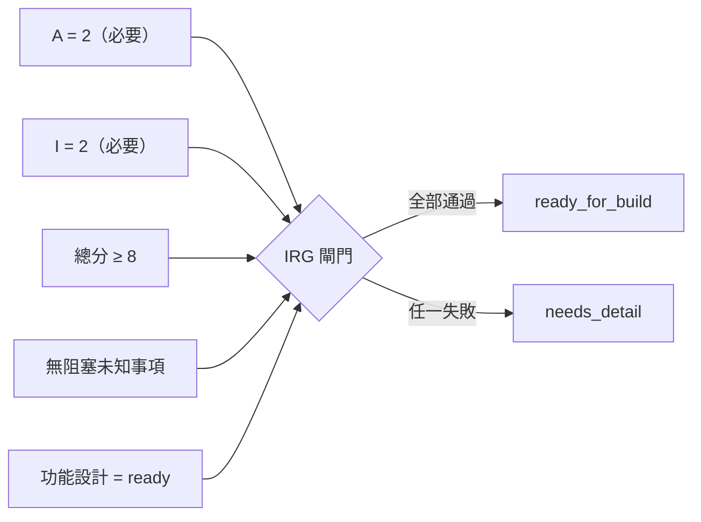

# 一致性閘門（Consistency Gates）

減少文件與實作之間偏移的量測標準。

## 閘門 1：可追溯性覆蓋
對於 `1-design/TASK_READINESS.md` 中 `Readiness = ready_for_build` 或 `2-build/WORK_QUEUE.md` 中 `Phase = build` 的每個任務，**且 `feature_id ≠ none`**：
- `Feature ID` 存在於 `3-verify/TRACEABILITY_MATRIX.md` 中
- 規格連結存在
- 計畫的程式碼/測試連結存在
- 相對於儲存庫的程式碼/測試連結，當它們預期為本地路徑時，在本地可解析

`feature_id: none` 的任務（例如工作空間設定任務）免除可追溯性要求。

引用規則：
- 直接使用、單一儲存庫和單體儲存庫工作使用相對於儲存庫的本地路徑
- 當工作空間將元件儲存庫保存在此儲存庫旁時，使用相對的相鄰簽出路徑，例如 `../api/src`
- 當程式碼不在本地時，聯合或側載工作使用明確的外部引用，例如 `repo:<component>@<ref>:<path>` 或固定的 URL

## 閘門 2：偏移狀態准入
有效的 `drift_status` 值：`aligned`（對齊）、`review_needed`（需要審查）、`drift_detected`（偵測到偏移）。

建置/驗證/同步任務不得在未解決偏移的情況下繼續：
- `drift_detected` 阻塞進展
- `accepted` 和 `done` 需要 `aligned`
- `review_needed` 是非阻塞的中間狀態；允許繼續，但在關閉任務前應解決此信號

配對慣例（不由 `make docs-check` 執行）：
- 設定 `drift_detected` 必須伴隨著該功能的 `GAPS_AND_DEVIATIONS.yaml` 記錄。
- 重置為 `aligned` 需要對應記錄先為 `resolved_in_loop` 或 `promoted_to_sync`。

## 閘門 3：佇列一致性檢查
執行：
```bash
make docs-check
```
這包括佇列 schema 檢查、就緒性檢查、路線圖覆蓋、依賴一致性、鎖定紀律和文件程式碼偏移檢查。
它還驗證帶有專家顧問的任務有支援的顧問記錄。
當特定階段檔案不存在時，選用進階檢查乾淨地跳過。

## 閘門 4：路線圖覆蓋
對每個排隊的任務：
- 記錄了 `Capability`
- 引用的能力存在於 `1-design/ROADMAP.md` 中

豁免：`feature_id: none` 的任務（設定、基礎設施、工具、運維）可以使用 `capability: none`——它們不服務於功能能力。功能任務（`feature_id != none`）在啟用後（建置階段或之後）必須引用真實的能力。在啟用中的功能任務上使用 `capability: none` 被視為錯誤。

## 閘門 5：依賴一致性
當 `2-build/TASK_DEPENDENCIES.md` 使用中時：
- 每個佇列任務都出現在其中
- 佇列的 `Build Dependencies` 和 `Design Dependencies` 與規範性依賴登記表匹配

## 閘門 6：並行鎖定紀律
當 `2-build/LOCKS.md` 使用中時：
- 每個 `in_progress` 的 `parallel` 任務都有非 `none` 的 `Lock ID`
- `2-build/LOCKS.md` 中存在匹配的活躍鎖定
- 鎖定所有者與佇列所有者匹配

## 準備實作量測（Ready-to-implement measure）
只有當以下所有條件都為真時，任務才準備好實作（來源：`1-design/TASK_READINESS.md`）：


1. `Readiness = ready_for_build`
2. IRG 分數 `>= 8/10`，且 `A = 2` 和 `I = 2`（強制維度）
3. `Blocking Unknowns = none`
4. 連結的功能設計狀態在 `1-design/DESIGN_STATES.md` 中為 `ready`
5. 若 `Advisor Gate = required`，已移至 `approved`
6. 功能列存在於可追溯性矩陣中，且不為 `drift_detected`

## 跨檔案一致性
這些配對必須保持對齊：
- `TASK_READINESS.Readiness = ready_for_build` → `WORK_QUEUE.Phase ≠ design`
- `WORK_QUEUE.Status = needs_rework` → `TASK_READINESS.Readiness = needs_detail`
- `WORK_QUEUE.Status ∈ {awaiting_human_review, accepted, done}` → 任務列存在於 `TASK_READINESS.md`

由 `make docs-check` 透過 `meta/checks/check-ready-queue-admission.sh` 偵測。
