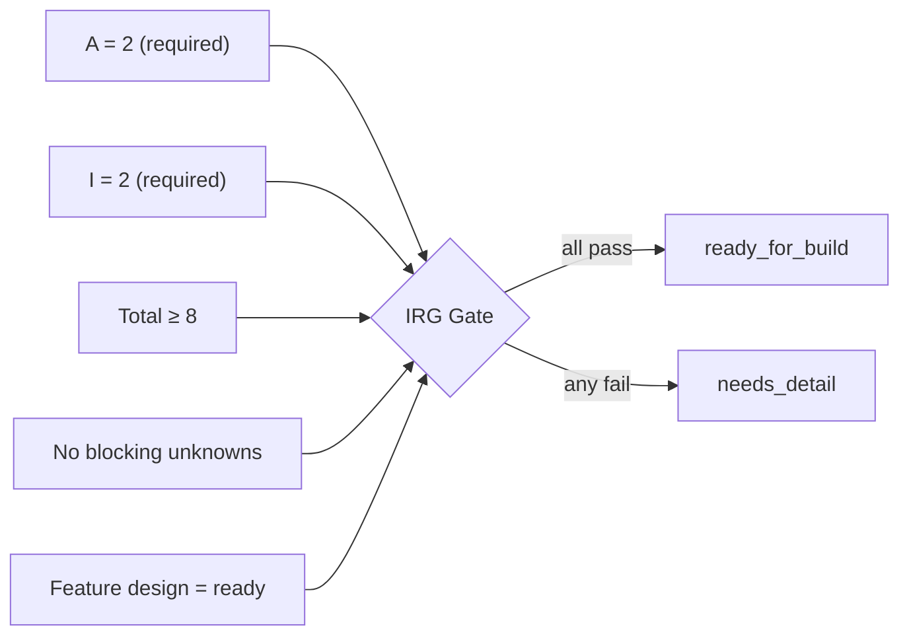

# Consistency Gates

Measures that reduce drift between documentation and implementation.

## Gate 1: Traceability coverage
For every task with `Readiness = ready_for_build` in `1-design/TASK_READINESS.md` or `Phase = build` in `2-build/WORK_QUEUE.md`, **and `feature_id ≠ none`**:
- `Feature ID` exists in `3-verify/TRACEABILITY_MATRIX.md`
- spec links are present
- planned code/test links are present
- repo-relative code/test links resolve locally when they are intended to be local paths

Tasks with `feature_id: none` (e.g. the workspace-setup task) are exempt from traceability requirements.

Reference rule:
- use repo-relative local paths for direct-use, single-repo, and monorepo work
- use relative sibling-checkout paths such as `../api/src` when the workspace keeps component repos next to this repo
- use explicit external references such as `repo:<component>@<ref>:<path>` or pinned URLs for federated or sideloaded work when the code is not present locally

## Gate 2: Drift status admission
Valid `drift_status` values: `aligned`, `review_needed`, `drift_detected`.

Build/verify/sync tasks must not proceed with unresolved drift:
- `drift_detected` blocks progression
- `accepted` and `done` require `aligned`
- `review_needed` is a non-blocking intermediate state; progression is allowed but the signal should be resolved before closing the task

Pairing convention (not enforced by `make docs-check`):
- Setting `drift_detected` must be accompanied by a `GAPS_AND_DEVIATIONS.yaml` entry for that feature.
- Resetting to `aligned` requires the corresponding entry to be `resolved_in_loop` or `promoted_to_sync` first.

## Gate 3: Queue consistency checks
Run:
```bash
make docs-check
```
This includes queue schema checks, readiness checks, roadmap coverage, dependency consistency, lock discipline, and doc-code drift checks.
It also verifies that tasks with specialist advisors have backing advisory records.
Optional advanced checks skip cleanly when their stage-specific files are absent.

## Gate 4: Roadmap coverage
For every queued task:
- `Capability` is recorded
- referenced capability exists in `1-design/ROADMAP.md`

Exemption: tasks with `feature_id: none` (setup, infrastructure, tooling, ops) may use `capability: none` — they are not in service of a feature capability. Feature tasks (`feature_id != none`) must reference a real capability once active (build phase or later). `capability: none` on an active feature task is caught as an error.

## Gate 5: Dependency consistency
When `2-build/TASK_DEPENDENCIES.md` is in use:
- every queue task appears there
- queue `Build Dependencies` and `Design Dependencies` match the canonical dependency register

## Gate 6: Parallel lock discipline
When `2-build/LOCKS.md` is in use:
- every `parallel` task that is `in_progress` has a non-`none` `Lock ID`
- matching active lock exists in `2-build/LOCKS.md`
- lock owner matches queue owner

## Ready-to-implement measure
A task is implementation-ready only when all are true (source: `1-design/TASK_READINESS.md`):


1. `Readiness = ready_for_build`
2. IRG score is `>= 8/10` with `A = 2` and `I = 2` (mandatory dimensions)
3. `Blocking Unknowns = none`
4. Linked feature design state is `ready` in `1-design/DESIGN_STATES.md`
5. If `Advisor Gate = required`, it has been moved to `approved`
6. Feature row exists in traceability matrix and is not `drift_detected`

## Cross-file consistency
These pairs must stay aligned:
- `TASK_READINESS.Readiness = ready_for_build` → `WORK_QUEUE.Phase ≠ design`
- `WORK_QUEUE.Status = needs_rework` → `TASK_READINESS.Readiness = needs_detail`
- `WORK_QUEUE.Status ∈ {awaiting_human_review, accepted, done}` → task row exists in `TASK_READINESS.md`

Detected by `make docs-check` via `meta/checks/check-ready-queue-admission.sh`.
