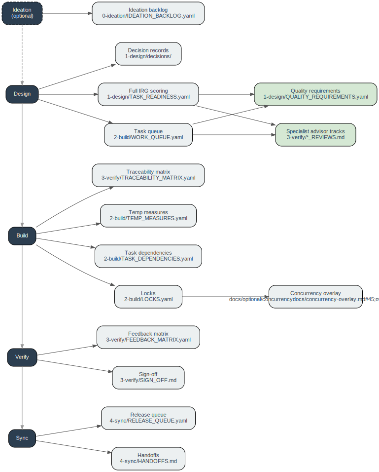

# Tiered Adoption

This template is designed to work at any scale — from a solo developer moving fast to a team with formal compliance requirements. The way it scales is through **process depth**: you start with a small, fixed core and add optional modules as the need becomes real.

There are no tiers to pick from, no boxes to fit into. Process depth is a description of how much of the template you have active, not a category you belong to.

---

## The core

Every project using this template runs the same loop regardless of process depth:

`Design → Build → Verify → Sync`

Within that loop, three things are always present:

- **The Build ↔ Verify rework cycle** — implementation loops back through verify until the task is accepted
- **Gap and deviation records** — nothing discovered during Build or Verify is silently discarded; it goes into `3-verify/GAPS_AND_DEVIATIONS.yaml` and is triaged at Sync
- **An IRG readiness check** — before anything moves to Build, there is always an explicit check: do I know what done looks like, and do I know what I'm building against? At low process depth this is a qualitative judgment; at higher depth it becomes the full numeric rubric

These three things are what make this template the same template at every scale. Below this floor, you have a different tool.

---

## Adding modules

Everything beyond the core is a module you enable when the problem calls for it. The trigger is always a real gap in the workflow — not a plan made upfront.

Common patterns:

- You find yourself losing track of what is in progress → add the **task queue**
- A task touches a security boundary → add a **specialist advisor track**
- Two people are building at the same time in the same branch → add **locks**
- Multiple people are working in separate branches that merge periodically → see **distributed teams** guide
- Multiple people are building against shared interfaces and assumptions are ambiguous → add **interface contracts**
- You need a record of who accepted what → add **sign-off**
- You are not sure the project direction is right yet → add **ideation backlog**

There is no migration when you add a module. Create the file, start using it. The template's checks (`make docs-check`) skip cleanly when a module's files are absent and enforce correctly once they exist.

If you are starting a project and already know you will need certain modules, `make init` offers preset bundles so you do not have to enable them one by one.

---

## How process depth grows

A project typically starts near the core and accumulates modules as it grows in scope, contributors, or stakes. The natural progression is:

1. **Core only** — one person, one task at a time, moving fast. The loop runs; gaps are recorded; IRG is a quick mental check.
2. **Add a queue and full IRG** — multiple tasks in flight, or a second contributor. The qualitative IRG check becomes the formal scoring rubric. TASK_READINESS becomes a separate file.
3. **Add traceability and feedback** — implementation needs to be verifiable against a spec; a human reviewer is distinct from the implementer.
4. **Add specialist tracks and quality requirements** — domain-sensitive work (security, API contracts, data migration) needs structured analysis before and during build.
5. **Add concurrency modules** — multiple agents or contributors working in parallel; locks, handoffs, and the concurrency overlay become necessary for same-branch work. For separate-branch parallel work, see `docs/guides/distributed-teams.md`; add interface contracts if shared boundaries are ambiguous.

You do not need to plan this progression upfront. Each step is triggered by a concrete need.

---

## Module tech tree

Each node is a module. An arrow means "requires." Add any module as soon as its prerequisites are in place — you do not need to add siblings or unrelated nodes first. Green nodes require prerequisites from two branches.

_To regenerate after editing `docs/diagrams/tiered-adoption.dot`: `make diagram`_

## Module reference

`Tested` = has been exercised in a real project end-to-end. Untested modules may have gaps in their doc or template that only surface in practice.

| Module | File | Requires | When to add | Tested |
|--------|------|----------|-------------|--------|
| [Ideation backlog](ideation-backlog.md) | `0-ideation/IDEATION_BACKLOG.yaml` | — | Direction or scope is still uncertain before committing to design | yes |
| [Decision records](decision-records.md) | `1-design/decisions/` | — | An architecture, contract, or ownership decision needs a durable record | yes |
| [Full IRG scoring](full-irg-scoring.md) | `1-design/TASK_READINESS.yaml` | core | Upgrade from qualitative to numeric rubric: multiple tasks in flight, multiple reviewers, or design disagreements | yes |
| [Task queue](task-queue.md) | `2-build/WORK_QUEUE.yaml` | core | More than one task in flight, or sessions are frequently interrupted | yes |
| [Specialist advisor tracks](specialist-tracks.md) | `3-verify/*_REVIEWS.md` | Full IRG + Task queue | A task touches security, experiments, data migration, API contracts, or incidents | no |
| [Quality requirements](quality-requirements.md) | `1-design/QUALITY_REQUIREMENTS.yaml` | Full IRG + Task queue | Non-functional or cross-cutting standards need per-task enforcement | yes |
| [Traceability matrix](traceability-matrix.md) | `3-verify/TRACEABILITY_MATRIX.yaml` | Task queue | Spec/code/test linkage needs to be maintained and drift needs to be detectable | yes |
| [Temp measures](temp-measures.md) | `2-build/TEMP_MEASURES.yaml` | Task queue | A temporary exception or workaround needs a tracked removal target | yes |
| [Task dependencies](task-dependencies.md) | `2-build/TASK_DEPENDENCIES.yaml` | Task queue | Upstream/downstream relationships between tasks need explicit tracking | yes |
| [Feedback matrix](feedback-matrix.md) | `3-verify/FEEDBACK_MATRIX.yaml` | Task queue | A human reviewer is distinct from the implementer and observations need a structured record | yes |
| [Sign-off](sign-off.md) | `3-verify/SIGN_OFF.md` | Task queue | A formal per-task acceptance audit trail is required | no |
| [Release queue](release-queue.md) | `4-sync/RELEASE_QUEUE.yaml` | Task queue | Completed work feeds a deployment pipeline and release candidates need tracking | yes |
| [Locks](locks.md) | `2-build/LOCKS.yaml` | Task queue | Multiple agents or contributors are building in parallel | no |
| [Handoffs](handoffs.md) | `4-sync/HANDOFFS.md` | Task queue | Ownership of a task transfers between people or agents and the history matters | yes |
| [Concurrency overlay](concurrency-overlay.md) | `docs/optional/concurrency-overlay.md` | Locks | High-concurrency same-branch projects need a full coordination protocol beyond locks alone | no |
| [Interface contracts](contracts.md) | `1-design/CONTRACTS.yaml` | — | Multiple people building against shared interfaces in separate workstreams; created on demand at a design merge | no |
