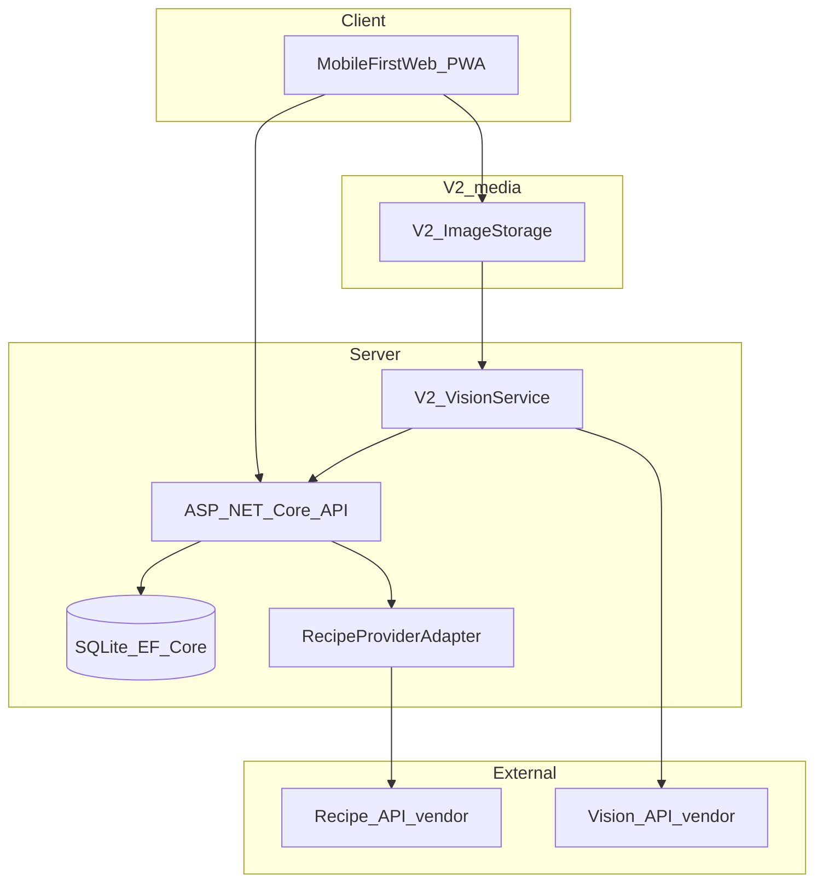

# Architecture overview

Human-readable system context for TrueSight (FridgeWise). Execution state remains in [`.awp-workspace/workspace-build/`](../../.awp-workspace/workspace-build/) registers.

Related ADRs: [ADR-20260523-01](../design/decisions/ADR-20260523-01-delivery-model-pwa-web.md), [ADR-20260523-02](../design/decisions/ADR-20260523-02-recipe-provider-adapter.md), [ADR-20260523-03](../design/decisions/ADR-20260523-03-v2-vision-boundary.md).

## Summary

TrueSight is a **mobile-first Progressive Web App-style** experience (responsive web, installable where the browser supports it) backed by an **ASP.NET Core** API. The client handles interaction and media capture; the server owns inventory, recipe orchestration, and integration with external recipe and (V2) vision providers. Persistence uses **EF Core + SQLite** for the first slice.

## High-level diagram

## Layers

| Layer | Responsibility | Technology |
|-------|----------------|------------|
| Presentation | UI, routing, camera/file capture, PWA shell (manifest, service worker when adopted) | React + TypeScript |
| API | Auth, validation, vertical slices, CQRS | ASP.NET Core minimal APIs |
| Data | Inventory, sessions, catalog | EF Core + SQLite |
| Integrations | Recipe search/match; V2 image understanding | Config-driven adapters |

## V1 vs V2 flows

**V1 — manual inventory**

1. User CRUDs `InventoryItem` via API.
2. API calls `RecipeProvider` with current stock; returns ranked suggestions.
3. User accepts a recipe → `RecipeSession` → deduct quantities.

**V2 — fridge photo**

1. User captures/uploads image in the browser (e.g. `getUserMedia` or `<input capture="environment">`).
2. Client uploads to **V2 image storage** (implementation TBD: object storage vs API-hosted upload).
3. **Vision service** returns candidate `DetectedItem` rows.
4. User confirms or edits → persisted as `InventoryItem`.
5. Same recipe flow as V1.

Human confirmation is mandatory before inventory writes from vision (see ADR-20260523-03).

## Camera on the web

Mobile browsers can access the camera with permission. Supported patterns include `MediaDevices.getUserMedia()` and file inputs with `accept="image/*"` and `capture="environment"` for rear-camera preference on many devices.

## Recipe provider (plug-and-play)

The domain does not depend on a specific vendor. The API uses a **RecipeProvider** interface; configuration selects Spoonacular, Edamam, or an internal/custom implementation. See [ADR-20260523-02](../design/decisions/ADR-20260523-02-recipe-provider-adapter.md).

## Vision provider (V2)

Image understanding is behind a **VisionService** boundary (OpenAI Vision, Gemini Vision, or other). The API normalizes responses to `DetectedItem`; no vendor types leak into core entities. See [ADR-20260523-03](../design/decisions/ADR-20260523-03-v2-vision-boundary.md).

## Code organization (API)

Vertical slices + CQRS per [`.cursor/rules/architecture.mdc`](../../.cursor/rules/architecture.mdc): Inventory, Recipes, Recognition (V2), Profile (future), Sessions.

Full slice map, folder conventions, and how to add a slice: [vertical-slices.md](vertical-slices.md).
