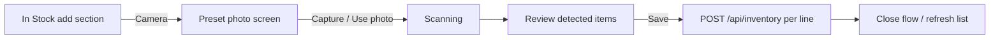

# FEAT-REC-002: Fridge photo recognition (V2)

**Status:** draft (Phase A mockup **build admitted** — `BUILD-REC-002-MOCKUP`)  
**Module:** Recognition  
**Related AWP feature_id:** `FEAT-REC-002`

## Summary

Let users capture or upload a fridge photo from the web client. A **VisionService** (production) or **client stub** (mockup) proposes `DetectedItem` candidates; the user **reviews and edits** quantity, unit, and expiry per line before any `InventoryItem` rows are written.

**Delivery order:** ship a **UI mockup** first (preset photo, stub detections, existing inventory API on save), then wire real upload + vision when V2 infrastructure is committed (OQ-005, OQ-006 deferred).

## User story

As a user, I want to photograph my fridge and review suggested items before they are saved, so I get speed without losing control over my inventory.

## Scope

### In scope — UI mockup (first slice)

- **Entry:** Small **camera** control beside the existing **Add** button in the **In Stock** add-item section ([FEAT-INV-001](FEAT-INV-001-manual-inventory.md) form; same field vocabulary: name, quantity, unit, optional expiry).
- **Camera screen:** Full-screen or sheet overlay that shows a **fixed preset fridge photo** (bundled asset — no live `getUserMedia` required for mockup). Optional single **Capture** or **Use photo** affordance that advances the flow (cosmetic only; always uses the preset).
- **Scan step:** Brief “Scanning…” state, then a **review list** of stub `DetectedItem` rows (name + suggested quantity/unit/expiry + confidence label).
- **Review:** Per row — include/exclude toggle; editable **name**, **quantity**, **unit** (quantity + unit on one row), **expiry date**; sticky **Save** / **Cancel** footer at bottom of screen.
- **Save:** **Save to inventory** persists only **included** rows via existing `POST /api/inventory` (merge rules unchanged). No recognition API calls in mockup.

### In scope — production V2 (after mockup)

- Upload endpoint and storage for fridge images (implementation detail).
- Vision adapter returning normalized candidates (name, estimated quantity, confidence — exact DTO TBD).
- Confirmation endpoint: user accepts/edits/rejects candidates → creates/updates `InventoryItem` (batch confirm API — TBD; mockup may keep N× POST).
- Live capture: `getUserMedia` or file input with `capture="environment"` ([ADR-20260523-01](../decisions/ADR-20260523-01-delivery-model-pwa-web.md)).

### Out of scope

- Receipt scanning ([IDEA-008](../../product/ideation.md#idea-008-receipt-photo--inventory-list)) — may share infrastructure later.
- Fully automatic inventory without confirmation.
- Training custom vision models.
- Real vision provider or image retention policy in the **mockup** slice (document at production admission).

## Behavior

### Phase A — UI mockup (design target now)

1. User taps **camera** next to **Add** on the inventory add form.
2. Overlay shows the bundled preset image (`/mockups/fridge-preset.jpg` — see [Preset photo asset](#preset-photo-asset)).
3. User taps **Use sample photo** → client shows **Scanning sample photo…** (~1–2 s) with preview banner → stub list (see [Mock detection payload](#mock-detection-payload)).
4. User adjusts quantity, unit, expiry; toggles off unwanted lines.
5. **Save to inventory** runs `POST /api/inventory` for each **included** row with quantity ≥ 1. **All-or-nothing:** only dismiss the overlay after **every** included row succeeds; if any request fails, show an error, keep the review screen, and do not treat the batch as complete (no partial dismiss — avoids duplicate merge on retry).
6. **Cancel** or **back** from Review **closes** the overlay with no API writes.

**Save button:** Disabled when no rows are checked, when any included row has quantity &lt; 1, or while save requests are in flight.

**Errors:** On failure, list which items failed (if known) and keep all review rows editable for retry.

### Phase B — production V2

1. Client uploads image (multipart or signed URL — TBD).
2. API stores blob, invokes `VisionService`, returns `DetectedItem[]`.
3. User reviews in UI (same review screen as mockup); client sends confirmation payload (batch endpoint preferred).
4. API materializes inventory changes transactionally.

**Confirmation UX (required for both phases):** Present each candidate with confidence (**high** / **medium** / **low**). User toggles lines on/off before save — never auto-add low-confidence items. See [UI principles](../ui-principles.md).

Privacy (production only): document retention and deletion policy for images (PII/location in EXIF — strip if needed).

## UI mockup — screens and layout

| Screen | Purpose | Key elements |
|--------|---------|----------------|
| **Add section (existing)** | Manual add unchanged | Ingredient, quantity, unit, expiry; **Add** + **Camera (preview)** icon on one row; see [Mockup labeling](#mockup-labeling) |
| **Camera** | Simulate capture | **Preview banner**; preset photo (full width); helper copy; primary **Use sample photo** |
| **Scanning** | Feedback | **Preview banner**; spinner + “Scanning sample photo…” (not “your fridge”) |
| **Review** | Human gate | Scrollable checklist rows (editable name); **sticky footer** with **Save to inventory** / **Cancel** at bottom of viewport |

### Mockup labeling

Users must never mistake the mockup for live AI or a real camera capture. Labeling is **required in Phase A** and **removed** when production vision ships (same screens, no preview chrome).

| Location | Requirement |
|----------|-------------|
| **Camera button** | Visible **“Preview”** pill/badge on or beside the icon (not only `aria-label`). Tooltip / `title`: “Try fridge photo preview (sample image)” |
| **`aria-label`** | “Try fridge photo preview (sample image, not a real scan)” |
| **Overlay header** | Every mockup screen (Camera, Scanning, Review): compact **info banner** — e.g. **“Preview — sample photo & suggested items, not real AI yet.”** Non-dismissible for the session (stays while overlay is open) |
| **Camera screen body** | Secondary line under banner: “Uses a fixed sample image to preview the flow.” Primary button text: **Use sample photo** (not “Capture” / “Take photo”) |
| **Scanning copy** | **“Scanning sample photo…”** — avoids implying the user’s fridge is being analyzed |
| **Review heading** | Title: **“Suggested items (preview)”**; one line: “Edit quantities and expiry, then save to your inventory.” |
| **Confidence badges** | Keep **High / Medium / Low**; optional footnote on Review: “Confidence shown for preview only.” |

**Tone:** Match the honest demo pattern used on login ([FEAT-AUTH-001](FEAT-AUTH-001-demo-login-screen.md), [ui-principles](../ui-principles.md) — clear that persistence is real but the **scan is simulated**.

**Production cutover:** When Phase B uses live upload + `VisionService`, remove Preview badge, preview banner, and “sample” wording; restore “Scanning your fridge…” and camera-appropriate primary labels per ADR-01.

### Entry control (beside Add)

| Property | Decision |
|----------|----------|
| Control | Icon button only (`Camera` / lucide), no text label on narrow screens |
| Placement | Immediately **right of** the full-width **Add** button — same grid row: Add flex-grows, camera fixed square (~44px touch target) |
| Style | Secondary / outline — must not compete visually with primary **Add** |
| Visible label | **Preview** badge on camera control (see [Mockup labeling](#mockup-labeling)) |
| `aria-label` | “Try fridge photo preview (sample image, not a real scan)” |

Reference: current add form ends with a full-width primary **Add** in `MainApp.tsx`; mockup splits that row into `[ Add (flex) | Camera (icon) ]`.

### Review row (per detected item)

| Field | Mockup | Notes |
|-------|--------|-------|
| Include | Checkbox, default **on** for high/medium, **off** for low | Matches [ui-principles](../ui-principles.md) example |
| Name | Text **input** (editable) | Correct mislabeled detections before save |
| Quantity | Same stepper/input as manual add; **same row as unit** | Integer ≥ 1 for included rows; **Save** disabled if any included row is &lt; 1 or name is blank |
| Unit | Same `<select>` options as manual add; **same row as quantity** | Validator enum (see manual add) |
| Expiry | `type="date"`, optional | Empty allowed |
| Confidence | Badge: High / Medium / Low | Not persisted |

### Preset photo asset

| Property | Value |
|----------|--------|
| **Repo path** | `frontend/public/mockups/fridge-preset.jpg` |
| **URL** | `/mockups/fridge-preset.jpg` (Vite/static `public/`) |
| **Content** | Stocked fridge interior (produce, dairy, meat, door condiments) — realistic overlap/packaging for demo |
| **Alt text** | “Sample refrigerator interior used for demo scan” |

Replace the file only when intentionally refreshing the demo; stub detections should stay plausible for what is visible in the image.

### Mock detection payload

Client-side constant aligned with the preset photo until `VisionService` exists:

| Name | Qty | Unit | Suggested expiry | Confidence |
|------|-----|------|------------------|------------|
| Eggs | 12 | count | +14 days from today | high |
| Cheddar cheese | 1 | count | +21 days | high |
| Butter | 1 | count | +30 days | medium |
| Ground beef | 1 | count | +3 days | medium |
| Salmon fillet | 1 | count | +2 days | medium |
| Green beans | 1 | count | +5 days | low |

Suggested expiry values are **pre-filled** date inputs; user may clear or change.

### Navigation and state

- Mockup uses a **single overlay stack**: Camera → Scanning → Review.
- **Back** from Review (or system back): **close** the overlay and discard in-memory detections (do not return to Camera with stale stub data).
- Do not navigate away from main app route; overlay keeps inventory list underneath.
- After successful save, return to main **In Stock** view with updated list.

## API / contracts

**Mockup:** `POST /api/inventory` only (one request per included review row). No new recognition routes.

**Production V2:**

| Method | Path | Notes |
|--------|------|-------|
| POST | `/api/recognition/fridge-upload` | Upload image; returns job id or sync candidates — TBD |
| GET | `/api/recognition/jobs/{id}` | If async processing |
| POST | `/api/recognition/fridge-confirm` | Body: confirmed/edited line items → inventory writes |

## Data model

- Transient: `DetectedItem` (see [domain model](../../product/domain-model.md))
- Persistent: `InventoryItem`; optional `FridgeImage` / audit entity — TBD
- Migrations: **N** (mockup); **Y** (production V2 when recognition entities ship)

## Acceptance criteria

### UI mockup (first build slice when admitted)

- [ ] Camera icon appears beside **Add** in the add-item section; manual add unchanged.
- [ ] **Preview** labeling visible on camera control and on every overlay screen (banner + copy per [Mockup labeling](#mockup-labeling)); no wording that implies real AI or user photo capture.
- [ ] Flow uses preset photo only (no live camera permission prompt required).
- [ ] Review screen lists stub detections with confidence; user can toggle lines and edit quantity, unit, expiry.
- [ ] **Save** disabled when no rows checked or any included quantity &lt; 1; disabled while requests run.
- [ ] **Save** all-or-nothing: overlay dismisses only if every included `POST /api/inventory` succeeds; on failure, review screen stays open.
- [ ] **Save** writes only included rows via `POST /api/inventory`; no silent auto-add.
- [ ] Cancel / back from Review closes overlay with no inventory writes.
- [ ] Preset image served from `/mockups/fridge-preset.jpg` (`frontend/public/mockups/fridge-preset.jpg`).

### Production V2

- [ ] No inventory mutation without explicit user confirmation step.
- [ ] Vision vendor types isolated behind `VisionService`.
- [ ] Documented flow matches [architecture overview](../../architecture/overview.md) V2 diagram.

## Traceability (AWP)

After approval, add/update rows in:

- `.awp-workspace/workspace-build/1-design/FEATURE_REGISTRY.yaml`
- `.awp-workspace/workspace-build/1-design/DESIGN_STATES.yaml` — `decision_links`: `docs/design/decisions/ADR-20260523-03-v2-vision-boundary.md`, `docs/design/decisions/ADR-20260523-01-delivery-model-pwa-web.md`
- `.awp-workspace/workspace-build/3-verify/TRACEABILITY_MATRIX.yaml`
- `.awp-workspace/workspace-build/2-build/WORK_QUEUE.yaml` (when V2 is admitted)

`spec_link` for build tasks → this file path.

## Advisor tracks

At build admission (see [advisor-policy.md](../advisor-policy.md)):

- Upload, vision, confirmation → `security` (files, retention, keys)
- Recognition API contract → `api_contract` when endpoints are defined

## Decisions

- [ADR-20260523-03](../decisions/ADR-20260523-03-v2-vision-boundary.md) — vision boundary and human confirmation.
- [ADR-20260523-01](../decisions/ADR-20260523-01-delivery-model-pwa-web.md) — web camera capture.
