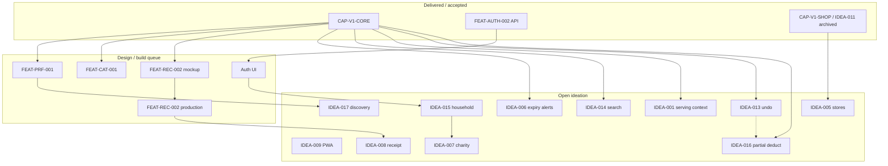

# Product ideation

Exploratory ideas **not** committed on the [roadmap](roadmap.md). Workflow: [../ideation/README.md](../ideation/README.md).

| Register | Path |
|----------|------|
| Active (open ideas) | [`.awp-workspace/0-ideation/IDEATION_BACKLOG.yaml`](../../.awp-workspace/0-ideation/IDEATION_BACKLOG.yaml) |
| Archive (promoted / parked) | [`.awp-workspace/0-ideation/archive/IDEATION_BACKLOG.yaml`](../../.awp-workspace/0-ideation/archive/IDEATION_BACKLOG.yaml) |

**Status:** `open` → discuss → `promoted` | `parked` | `dropped` → move to **archive** YAML.

References in **Depends on** may be `IDEA-*`, `FEAT-*`, or `CAP-*`. See [Dependencies and sequencing](#dependencies-and-sequencing).

**Sync 2026-05-26:** Promoted ideas (002–004, 011–012) archived; discovery remainder is **IDEA-017**.

---

## Dependencies and sequencing

Ideation items are not all independent. Some only make sense after core loop, auth, or another idea ships.

### Layers (what must exist first)

### Per-idea prerequisites (active backlog)

| ID | Depends on | Notes |
|----|------------|--------|
| IDEA-001 | `CAP-V1-CORE`, `FEAT-REC-001` | **Partial:** per-recipe servings stepper exists |
| IDEA-005 | `IDEA-011` (archived), `CAP-V1-CORE` | Shopping list shipped |
| IDEA-006 | `CAP-V1-CORE` | **Partial:** expiring-soon styling + tab hint only |
| IDEA-007 | `IDEA-015` | Charity/org — after household |
| IDEA-008 | `CAP-V1-CORE`; prod: `FEAT-REC-002` | Receipt vision |
| IDEA-009 | `CAP-V1-CORE` | Manifest / service worker |
| IDEA-013 | `FEAT-SES-001` | Post-cook undo |
| IDEA-014 | `CAP-V1-CORE` | Client-side search/filter |
| IDEA-015 | `FEAT-AUTH-002`, auth UI | API done; UI not wired |
| IDEA-016 | `FEAT-SES-001`, `FEAT-REC-001` | Partial deduct at accept |
| IDEA-017 | `CAP-V1-CORE`, `FEAT-PRF-001` | Discovery browse (ex-IDEA-002) |

**Delivered outside active ideation:** V1 core, security, auth API, shopping (`FEAT-SHP-001`), fridge mockup (`FEAT-REC-002` Phase A) — see [roadmap](roadmap.md) and `.awp-workspace/2-build/WORK_QUEUE.yaml`.

---

## Active index (open)

| ID | Title | Theme | Impl. | Depends on |
|----|-------|-------|-------|------------|
| IDEA-001 | Serving size selector | Recipes & UX | partial | CAP-V1-CORE |
| IDEA-005 | Store recommendations | Commerce | — | IDEA-011, CAP-V1-CORE |
| IDEA-006 | Expiry proximity warnings | Inventory | partial | CAP-V1-CORE |
| IDEA-007 | Charity / food-bank persona | Personas | — | IDEA-015 |
| IDEA-008 | Receipt photo → inventory | Smart input | — | CAP-V1-CORE; FEAT-REC-002 prod |
| IDEA-009 | PWA install + offline shell | Platform | — | CAP-V1-CORE |
| IDEA-013 | Post-cook adjust / undo deduct | Recipes & trust | — | FEAT-SES-001 |
| IDEA-014 | Inventory search and filter | Inventory & UX | — | CAP-V1-CORE |
| IDEA-015 | Household shared lists | Personas | — | FEAT-AUTH-002, auth UI |
| IDEA-016 | Partial deduction on cook | Recipes & UX | — | FEAT-SES-001 |
| IDEA-017 | Discovery browse beyond inventory | Recipes & UX | — | CAP-V1-CORE, FEAT-PRF-001 |

**Impl.:** `partial` = some behavior shipped; ideation scope not complete. `—` = not built.

---

## Archived index (promoted / parked)

Full entries: [archive IDEATION_BACKLOG.md](../../.awp-workspace/0-ideation/archive/IDEATION_BACKLOG.md).

| ID | Title | Status | Promotion / notes |
|----|-------|--------|-------------------|
| IDEA-002 | Cuisine preferences & discovery | promoted | Cuisine → `FEAT-PRF-001`; discovery → **IDEA-017** |
| IDEA-003 | Dietary restrictions & allergies | promoted | `FEAT-PRF-001` (design only) |
| IDEA-004 | Skill level & equipment | promoted | `FEAT-PRF-001` (design only) |
| IDEA-011 | Shopping list | promoted | **Shipped** `FEAT-SHP-001`; BUILD-SHP-004 polish queued |
| IDEA-012 | Use-first / prioritize expiring | promoted | `FEAT-PRF-001` (design only) |
| IDEA-010 | Firebase-first stack | parked | Not committed stack |

---

## Open ideas (detail)

### IDEA-001: Serving size selector

**Status:** open · **Implementation:** partial (per-recipe servings stepper in V1)

Extend to remembered/default “cooking for N people” across sessions. Affects `RecipeSession` serving multiplier.

---

### IDEA-005: Store recommendations (distance, price)

**Status:** open

Suggest where to buy missing ingredients. Needs external data + privacy spike.

---

### IDEA-006: Expiry proximity warnings

**Status:** open · **Implementation:** partial (3-day row highlight + “N expiring soon” on In Stock tab)

Add proactive warnings (banner, push). Push benefits from IDEA-009. Distinct from archived IDEA-012 (ranking → `FEAT-PRF-001`).

---

### IDEA-007: Charity / food-bank persona

**Status:** open · **Depends on:** IDEA-015

Org-scale shared inventory; not MVP. See [project-brief.md](project-brief.md).

---

### IDEA-008: Receipt photo → inventory list

**Status:** open

Review-before-save flow; may share `FEAT-REC-002` vision infrastructure (OQ-005/006).

---

### IDEA-009: PWA install + offline shell

**Status:** open

Manifest, service worker, optional read-only offline inventory.

---

### IDEA-013: Post-cook adjust and undo deduction

**Status:** open · **Depends on:** `FEAT-SES-001` (shipped)

Undo or edit `RecipeSession` deductions. Alternative to IDEA-016.

---

### IDEA-014: Inventory search and filter

**Status:** open

Name search + expiring-soon filter on client; no backend required for V1 slice.

---

### IDEA-015: Household shared inventory and shopping list

**Status:** open · **Depends on:** `FEAT-AUTH-002` + auth UI

Partners share one inventory/shopping list. API auth exists; login screen not in `App` flow yet.

---

### IDEA-016: Partial ingredient deduction on cook

**Status:** open

Per-line deduct less than recipe amount (OQ-042). Pair with or before IDEA-013.

---

### IDEA-017: Discovery browse beyond inventory

**Status:** open · **Split from archived IDEA-002 (2026-05-26)**

Browse recipes not strictly limited to current stock. Recommend `FEAT-PRF-001` for filter metadata first.

---

## Promotion checklist

When moving an idea to **promoted**:

1. Add capability or feature to [roadmap.md](roadmap.md) and `.awp-workspace/1-design/ROADMAP.yaml`
2. Add user stories to [user-stories.md](user-stories.md) under the right phase
3. Create `docs/design/features/FEAT-*.md` and register rows (see `.cursor/snippets/awp-admit-task.md`)
4. Move YAML entry to `.awp-workspace/0-ideation/archive/IDEATION_BACKLOG.yaml` with `decision: promoted`
5. Remove from active `IDEATION_BACKLOG.yaml` and update this file
